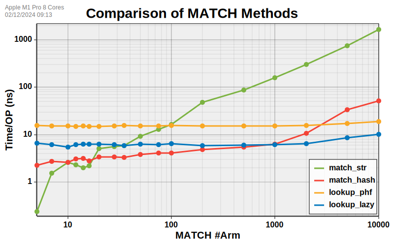

[](https://crates.io/crates/hashmatch)
[](https://opensource.org/licenses/MIT)
[](https://docs.rs/hashmatch)

# hashmatch

More efficient `static &str` matching when match #arm > 30.

## Usage
``` rust
use hashmatch::{hash_arm, hash_str};
// to avoid hash conflict
#[deny(unreachable_patterns)]
let res = match hash_str("ABC") {
    hash_arm!("ABC") => 1,
    hash_arm!("AAA") | hash_arm!("BBB") => 2,
    _ => 3,
};
assert_eq!(res, 1);
```

The `hash_arm!` will compute each arm's hash during compiling, and expand it to
``` rust
let res = match hash_str("ABC") {
    5661343534983258464u64 => 1,
    8040774132769170485u64 | 15932663093540935610u64 => 2,
    _ => 3,
};
```

## Why `hashmatch`?

For current rustc, the string matching with large arm number is linear complexity O(n). While the matching complexity of hash (`u64`) is O(log(n)).

`hashmatch` achieves matching string's hash from 2 sides:

1. For each match arm, using `hashmatch::hash_arm!` to get string's static hash during compiling.
2. For the value to be matched, use `hashmatch::hash_str` to get string's hash in runtime, which is consistent to `hashmatch::hash_arm!`.

**But there is a potential risk when encounter DOS attacks.**

## Benchmark


You can run the benchmark in your environment by `cargo bench`, requiring ~20min.

The benchmark compared 4 methods:
+ `match_str`: Directly match string. **O(n)**
    ``` rust
    match s {
        "xrxeclxu" => Some(0),
        "vukddz" => Some(1),
        "qwhkdyjog" => Some(2),
        "dpesutax" => Some(3),
        "tqgzzfcblp" => Some(4),
        _ => None,
    }
    ```
+ `match_hash`: (this) Compute string's hash, then match `u64`. **O(log(n))**
    ``` rust
    match hash_str(s) {
        hash_arm!("xrxeclxu") => Some(0),
        hash_arm!("vukddz") => Some(1),
        hash_arm!("qwhkdyjog") => Some(2),
        hash_arm!("dpesutax") => Some(3),
        hash_arm!("tqgzzfcblp") => Some(4),
        _ => None,
    }
    ```
+ `lookup_phf`: Create const hashmap in compiling time. **O(1)**
    ``` rust
    const STRING_MAP: phf::Map<&str, usize> = phf::phf_map! {
        "xrxeclxu" => 0,
        "vukddz" => 1,
        "qwhkdyjog" => 2,
        "dpesutax" => 3,
        "tqgzzfcblp" => 4
    };
    STRING_MAP.get(s).copied()
    ```
+ `lookup_lazy`: Create lazy hashmap. **O(1)**
    ``` rust
    static STRING_MAP: std::sync::LazyLock<foldhash::HashMap<&str, usize>> =
        std::sync::LazyLock::new(|| {
            use foldhash::HashMapExt;
            let mut map = foldhash::HashMap::with_capacity(5);
            map.insert("xrxeclxu", 0);
            map.insert("vukddz", 1);
            map.insert("qwhkdyjog", 2);
            map.insert("dpesutax", 3);
            map.insert("tqgzzfcblp", 4);
            map
        });
    STRING_MAP.get(s).copied()
    ```