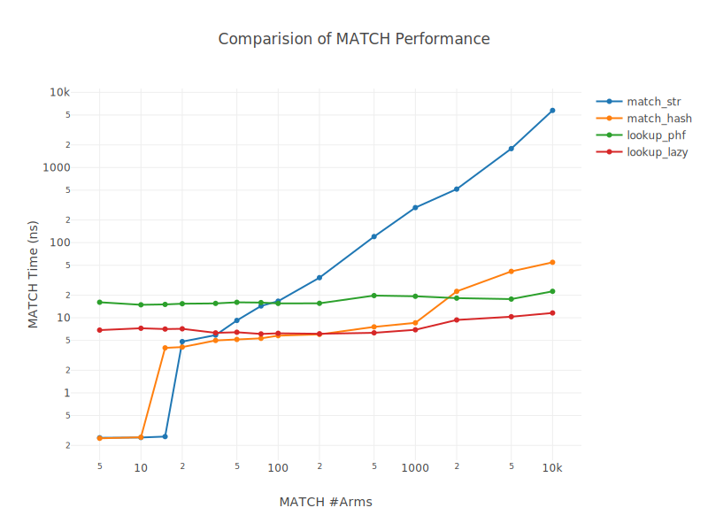

# hash-match

More efficient static &str match when #arm > 40.

``` rust
use hashmatch::{hash_arm, hash_str};
// to avoid hash conflict
#[deny(unreachable_patterns)]
let res = match hash_str("ABC") {
    hash_arm!("ABC") => 1,
    hash_arm!("AAA") | hash_arm!("BBB") => 2,
    _ => 3,
};
assert_eq!(res, 1);
```

